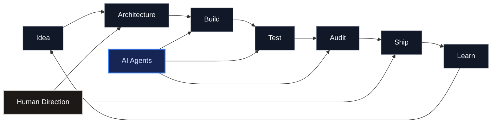

<!--
  Joshua Williams / mrjw717
  GitHub Profile README

  Recommended repository structure:

  mrjw717/
  ├── README.md
  └── assets/
      └── profile/
          ├── hero-dark.svg
          └── hero-light.svg
-->

<div align="center">

<picture>
  <source
    media="(prefers-color-scheme: dark)"
    srcset="./assets/profile/hero-dark.svg"
  />
  <source
    media="(prefers-color-scheme: light)"
    srcset="./assets/profile/hero-light.svg"
  />
  
</picture>

<br />

<kbd>FOUNDER</kbd>
&nbsp;
<kbd>SOFTWARE BUILDER</kbd>
&nbsp;
<kbd>PRODUCT ARCHITECT</kbd>
&nbsp;
<kbd>AI-NATIVE ENGINEERING</kbd>

<br /><br />

### Joshua Williams

**Building software, systems, and the machinery behind them.**

`@mrjw717` · Linux · Pennsylvania

</div>

---

<table>
<tr>
<td width="50%" valign="top">

### `01 // CURRENT WORK`

**Kynex Media**

AI-native software company and product studio focused on practical software, internal tooling, and independent technology products.

**Shipwright Systems**

Multi-vertical SaaS infrastructure built around reusable systems, shared services, and industry-specific applications.

</td>
<td width="50%" valign="top">

### `02 // PRIMARY INTERESTS`

```text
AI-native architecture
agent orchestration
developer tooling
local-first software
vertical SaaS
desktop applications
automation
human-in-the-loop systems
```

</td>
</tr>
</table>

---

## `03 // SYSTEM PROFILE`

```text
NAME       Joshua Williams
HANDLE     mrjw717
ROLE       Founder / Software Builder
STARTED    Late 1990s
MODE       Self-taught
PLATFORM   Linux
FOCUS      Software + AI + Product Systems

PHILOSOPHY
├── correctness before cleverness
├── KISS / YAGNI
├── explicit system boundaries
├── deterministic verification
├── local-first where practical
└── agents as collaborators, not autocomplete
```

<details>
<summary><kbd> OPEN BACKGROUND.DAT </kbd></summary>

<br />

I started building websites around age **13** in the late 1990s.

My first tools were **Microsoft FrontPage** and **Dreamweaver**, followed by Joomla, WordPress, graphic design, branding, and client work.

I later moved into merchant acquiring and payment processing.

In **2006**, I co-founded **Business Payment Innovations**, where I helped build a nationwide independent sales organization with a revolving network of roughly 30–50 active agents.

I later founded **TrustUs Processing** before returning my primary focus to software and technology.

In **2019**, I founded **Kynex Media**.

That background still influences the way I build software today.

I tend to think about software less as isolated features and more as:

`systems → workflows → incentives → operations → products`

</details>

---

## `04 // ENGINEERING MODEL`



<div align="center">

<sub>
The goal isn't to make AI write more code.<br />
The goal is to build engineering systems in which humans and agents can produce better software together.
</sub>

</div>

---

## `05 // OPEN-SOURCE + EXPERIMENTS`

I build around developer productivity, visualization, automation, local-first software, and AI-assisted engineering.

### Code Graph

Source-code relationship visualization and developer knowledge tooling for Obsidian.

```text
source code
    │
    ├── imports
    ├── calls
    ├── inheritance
    ├── tests
    ├── documentation
    └── architectural relationships
             │
             ▼
       interactive graph
```

### Vibe Speaker

Privacy-focused local speech-to-text desktop software built around local transcription.

### Experiments

`agent orchestration` · `MCP` · `procedural graphics` · `animation systems` · `developer workflows`

---

## `06 // TOOLCHAIN`

<div align="center">

<kbd> TypeScript </kbd>
<kbd> JavaScript </kbd>
<kbd> React </kbd>
<kbd> Next.js </kbd>
<kbd> Rust </kbd>
<kbd> Tauri </kbd>
<kbd> Python </kbd>

<br /><br />

<kbd> PostgreSQL </kbd>
<kbd> Supabase </kbd>
<kbd> Convex </kbd>
<kbd> Node.js </kbd>
<kbd> Tailwind </kbd>
<kbd> Stripe </kbd>
<kbd> Vercel </kbd>

<br /><br />

<kbd> GitHub Actions </kbd>
<kbd> MCP </kbd>
<kbd> AI Agents </kbd>
<kbd> Linux </kbd>

</div>

---

<details>
<summary><kbd> EXECUTE: engineering-philosophy.sh </kbd></summary>

<br />

```bash
#!/usr/bin/env philosophy

correctness > cleverness

prefer simple systems
prefer explicit boundaries
prefer reusable infrastructure
test what matters
verify what ships

if complexity_has_no_job:
    delete(complexity)

while building:
    explore()
    implement()
    test()
    audit()
    learn()
```

</details>

<details>
<summary><kbd> EXECUTE: agent-runtime.sh </kbd></summary>

<br />

```text
                    ┌──────────────────┐
                    │ HUMAN DIRECTION  │
                    └────────┬─────────┘
                             │
                    ┌────────▼─────────┐
                    │   ORCHESTRATOR   │
                    └────────┬─────────┘
                             │
             ┌───────────────┼───────────────┐
             │               │               │
             ▼               ▼               ▼
         EXPLORER         BUILDER        TEST ENGINEER
             │               │               │
             └───────────┐   │   ┌───────────┘
                         ▼   ▼   ▼
                      AUDITOR
                         │
                         ▼
                       SHIP
```

I use specialized AI agents for exploration, implementation, testing, security review, auditing, and verification — with humans retaining architectural and release authority.

</details>

---

## `07 // BUILD PRINCIPLES`

<table>
<tr>
<td align="center"><b>01</b><br /><sub>CORRECTNESS</sub></td>
<td align="center"><b>02</b><br /><sub>SIMPLICITY</sub></td>
<td align="center"><b>03</b><br /><sub>RELIABILITY</sub></td>
<td align="center"><b>04</b><br /><sub>MAINTAINABILITY</sub></td>
</tr>
<tr>
<td align="center">Make it right.</td>
<td align="center">Remove what<br />doesn't earn its place.</td>
<td align="center">Prove behavior.</td>
<td align="center">Build for the next<br />person — including me.</td>
</tr>
</table>

---

<div align="center">

### `STATUS // BUILDING`

$$\mathcal{Ideas \rightarrow Systems \rightarrow Products}$$

<kbd> explore </kbd>
→
<kbd> build </kbd>
→
<kbd> verify </kbd>
→
<kbd> ship </kbd>

<br /><br />

**[Kynex Media](https://kynexmedia.com)** · **[Shipwright Systems](https://shipwright.systems)** · **[GitHub](https://github.com/mrjw717)**

<br />

<sub>
I build things, test ideas, and turn the ones that survive into products.
</sub>

</div>
