<!-- Copy this README and the complete assets/myspace folder together. -->

<picture>
  <source media="(max-width: 600px) and (prefers-color-scheme: dark)" srcset="assets/myspace/header-dark-mobile.svg">
  <source media="(max-width: 600px)" srcset="assets/myspace/header-light-mobile.svg">
  <source media="(prefers-color-scheme: dark)" srcset="assets/myspace/header-dark.svg">
  <source media="(prefers-color-scheme: light)" srcset="assets/myspace/header-light.svg">
  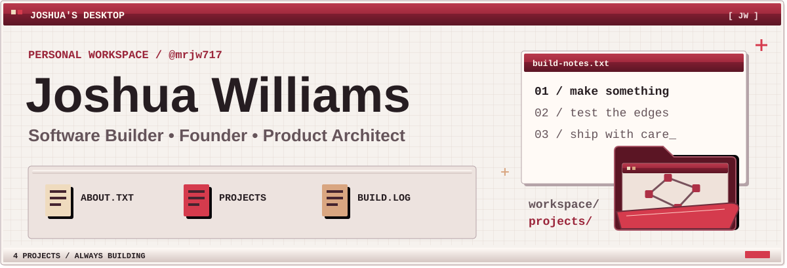
</picture>

  
  

  <a href="https://github.com/mrjw717">GitHub</a> ·
  <a href="https://kynexmedia.com">Kynex Media</a> ·
  <a href="#joshuas-top-projects">View projects</a>

<picture>
  <source media="(max-width: 600px) and (prefers-color-scheme: dark)" srcset="assets/myspace/blurbs-dark-mobile.svg">
  <source media="(max-width: 600px)" srcset="assets/myspace/blurbs-light-mobile.svg">
  <source media="(prefers-color-scheme: dark)" srcset="assets/myspace/blurbs-dark.svg">
  <source media="(prefers-color-scheme: light)" srcset="assets/myspace/blurbs-light.svg">
  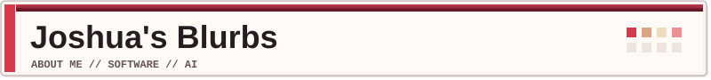
</picture>

### Hey, I'm Joshua.

Founder, software builder and product architect working in **AI-native engineering**.

I'm building **Kynex Media** and **Shipwright Systems**, alongside developer tools **Code Graph** and **Vibe Speaker**.

Self-taught. Building software since the late 1990s.

 

<b>View my profile card</b>

 

<picture>
  <source media="(prefers-color-scheme: dark)" srcset="assets/myspace/profile-card-dark.svg">
  <source media="(prefers-color-scheme: light)" srcset="assets/myspace/profile-card-light.svg">
  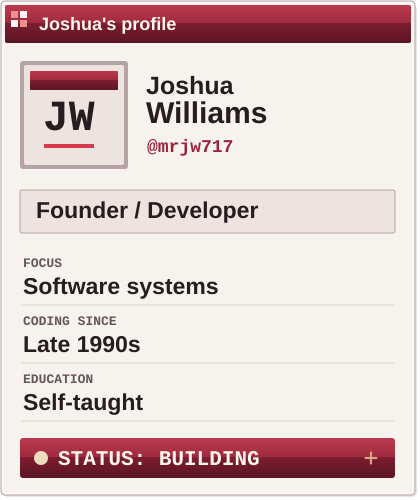
</picture>

<picture>
  <source media="(prefers-color-scheme: dark)" srcset="assets/myspace/divider-pixels-dark.svg">
  <source media="(prefers-color-scheme: light)" srcset="assets/myspace/divider-pixels-light.svg">
  
</picture>

<picture>
  <source media="(max-width: 600px) and (prefers-color-scheme: dark)" srcset="assets/myspace/top-projects-dark-mobile.svg">
  <source media="(max-width: 600px)" srcset="assets/myspace/top-projects-light-mobile.svg">
  <source media="(prefers-color-scheme: dark)" srcset="assets/myspace/top-projects-dark.svg">
  <source media="(prefers-color-scheme: light)" srcset="assets/myspace/top-projects-light.svg">
  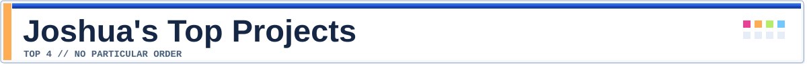
</picture>

  <a href="https://github.com/mrjw717/obsidian-code-graph">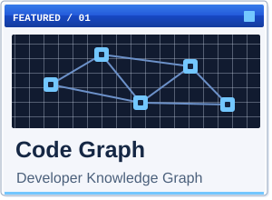</a>
  <a href="https://github.com/mrjw717/Vibe-Speaker">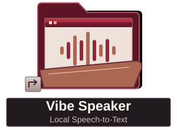</a>
  <a href="https://kynexmedia.com">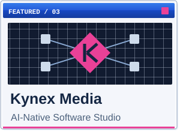</a>
  <a href="#shipwright-systems">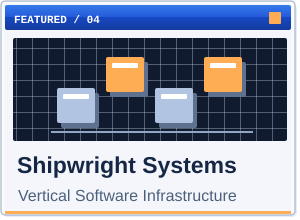</a>

- **[Code Graph](https://github.com/mrjw717/obsidian-code-graph)** · Developer knowledge graph. Explore code relationships alongside your Obsidian notes.
- **[Vibe Speaker](https://github.com/mrjw717/Vibe-Speaker)** · Local speech-to-text for voice-driven work.
- **[Kynex Media](https://kynexmedia.com)** · AI-native software studio.
- **Shipwright Systems** · Vertical software infrastructure.

<picture>
  <source media="(prefers-color-scheme: dark)" srcset="assets/myspace/divider-pixels-dark.svg">
  <source media="(prefers-color-scheme: light)" srcset="assets/myspace/divider-pixels-light.svg">
  
</picture>

<picture>
  <source media="(prefers-color-scheme: dark)" srcset="assets/myspace/contact-box-dark.svg">
  <source media="(prefers-color-scheme: light)" srcset="assets/myspace/contact-box-light.svg">
  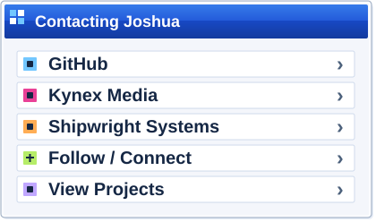
</picture>

  <a href="https://github.com/mrjw717">Follow / connect on GitHub</a> ·
  <a href="https://kynexmedia.com">Kynex Media</a> 
  <a href="#shipwright-systems">Shipwright Systems</a> ·
  <a href="#joshuas-top-projects">View projects</a>

  <a href="https://github.com/mrjw717">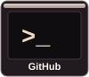</a>
  <a href="https://github.com/mrjw717/obsidian-code-graph">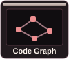</a>
  <a href="https://github.com/mrjw717/Vibe-Speaker">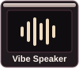</a>
  <a href="https://kynexmedia.com">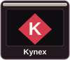</a>

<picture>
  <source media="(max-width: 600px) and (prefers-color-scheme: dark)" srcset="assets/myspace/footer-dark-mobile.svg">
  <source media="(max-width: 600px)" srcset="assets/myspace/footer-light-mobile.svg">
  <source media="(prefers-color-scheme: dark)" srcset="assets/myspace/footer-dark.svg">
  <source media="(prefers-color-scheme: light)" srcset="assets/myspace/footer-light.svg">
  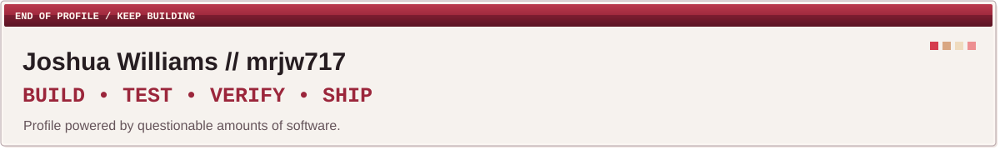
</picture>
